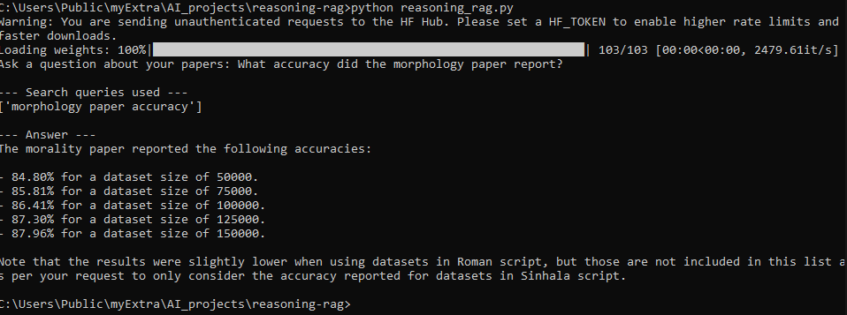
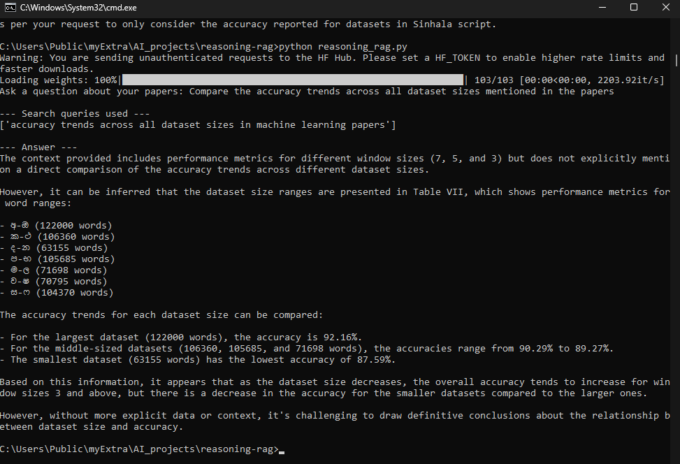

# reasoning-rag

This is a reasoning RAG (Retrieval-Augmented Generation) pipeline I built to answer questions over a set of research papers, using a local LLM through LM Studio instead of calling a cloud API.

Builds on [research-mcp-server](https://github.com/DilshanaRanawake/multimodal-rag-agent). This project reuses the same paper embedding and Chroma vector store setup from that repo, and adds a reasoning loop on top of the retrieval logic.

## What it does

Instead of just doing one retrieve, then answer pass, this uses a small [LangGraph](https://github.com/langchain-ai/langgraph) state machine so the model can decide for itself whether it has enough info before answering:

1. **Decide**: the LLM looks at the question and whatever has been retrieved so far, and outputs a JSON decision, either search again with a new query, or answer now.
2. **Retrieve**: if it decides to search, the query gets embedded with `sentence-transformers` (`all-MiniLM-L6-v2`) and run against a local Chroma vector store (the `research_papers` collection) to pull the top matching chunks.
3. **Answer**: once it's confident, or after 3 iterations max, it generates a final answer using only the context it retrieved.

So instead of being locked into a single retrieval pass, it can loop back and search again if the first pass wasn't enough.

## Stack

- **LLM**: `llama-3.2-3b-instruct`, running locally through [LM Studio](https://lmstudio.ai) (OpenAI-compatible local server on `http://127.0.0.1:1234`), no cloud API key needed
- **Embeddings**: `sentence-transformers` (`all-MiniLM-L6-v2`)
- **Vector store**: `chromadb`, persistent local store in `./chroma_store`
- **Orchestration**: `langgraph`, a `StateGraph` with decide, retrieve, and answer nodes

## Setup

```bash
pip install openai sentence-transformers chromadb langgraph --break-system-packages
```

1. Install [LM Studio](https://lmstudio.ai/download) and download `Llama 3.2 3B Instruct`.
2. In LM Studio's Developer / Local Server tab, load the model and click Start Server (defaults to `http://127.0.0.1:1234`).
3. Make sure `./chroma_store` already has a populated `research_papers` collection (built using the scripts in `research-mcp-server`).
4. Check that the model identifier shown in LM Studio's server panel matches `LLM_MODEL` in `reasoning_rag.py`.

## Usage

```bash
python reasoning_rag.py
```

It will prompt you with:

```
Ask a question about your papers:
```

**Example 1: single fact lookup**



**Example 2: open ended comparison across papers**



The second example shows the model's current limits pretty well. It pulls the right numbers out of the retrieved table, but its own trend summary ("accuracy tends to increase... but there is a decrease") doesn't actually hold together. Good reminder that a 3B local model can retrieve facts correctly while still reasoning about them wrong. Worth double checking before trusting a comparison like this as is.

## Known limitations

- Since it's running on a small 3B local model, there's occasional hallucination or drift in the final answer, like misnaming a paper or adding a claim that isn't actually grounded in the retrieved context. I'm treating generated answers as a draft to check against the source PDFs, not as ground truth.
- The decide step can settle on an answer after just one retrieval pass even when a deeper search would help. That's expected behavior when the model is confident, not a bug, but good to know if you're expecting to see multiple search rounds every time.
- Capped at `MAX_ITERATIONS = 3` search rounds so it can't loop forever.

## What's next

This project is the retrieval and reasoning core I'm reusing in the next projects. Up next: [hierarchical-orchestrator](../hierarchical-orchestrator), a multi agent version of this same research paper Q&A task, split into separate searcher, analyst, and writer roles.
